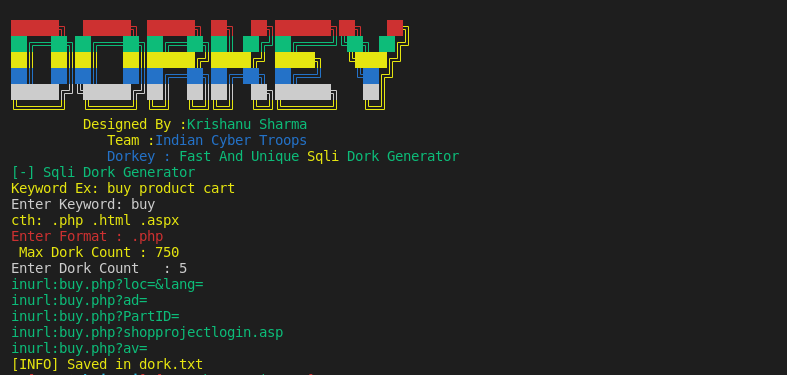

# DorKey
Dorkey is Dork generator For Sql Injection It includes Php Aspx And other extension Its Simple Fast And Lightweight Sqli Dork Generator 
Dorkes Can Be Used to Find Sql Injection Vulnerable sites
SQL injection, also known as SQLI, is a common attack vector that uses malicious SQL code for backend database manipulation to access information that was not intended to be displayed. This information may include any number of items, including sensitive company data, user lists or private customer details
We Are Not Responsible For Any Damage Caused By Tool To Any Web And System We've Designed This For Educational Purpose 
If you Liked Tool Then just Star Repo And Contribute If You Can #Thanks 
Just Execute And Choose Options And Enter Site And it Will Automatically Work Results are Saved into text files you can check directory to check files 
open issue if you face any problem related tool {we are not responding on your system related issue}
## Designed By : K. Sharma
<p>
 <a href="https://www.youtube.com/c/indiancybertroops">
    
  </a>
    <a href="https://instagram.com/indiancybertroops">
    
  </a>
     <a href="https://t.me/indiancybertroops">
    
  </a>

</p>
   
   


### Team Indian Cyber Troops:
>Created By : Krishanu Sharma 

# Features:
>Easy to Install

>Easy to Use

>Designed In Bash(shell scripting)

>Easy To Execue

>Fastest 

>No Bandwith/Data Consume

>To Create Sqli Dorks

# Main Phanto-M Image

# Installation :
> clone via git clone

```
git clone https://github.com/indiancybertroops/DorKey
```
```
cd DorKey
```
```
chmod +777 *
```
```
sudo bash DorKey.sh
```


# Github Status
[](https://github.com/indiancybertroops "Stats")<br>

## Contact Us: 


>Instagram
https://instagram.com/krishanuIND
>Instagram
https://instagram.com/Indiancybertroops


>Twitter
https://twitter.com/krishanuIND


>Github
https://github.com/indiancybertroops

## WARNING : 
***This tool is only for educational purpose. If you use this tool for other purposes except education we will not be responsible in such cases. We Are Not Responsible For Damage Caused By Tool***

[!] legal disclaimer: Usage of DorKey for attacking targets without prior mutual consent is illegal. It is the end user's responsibility to obey all applicable local, state and federal laws. Developers assume no liability and are not responsible for any misuse or damage caused by this program
